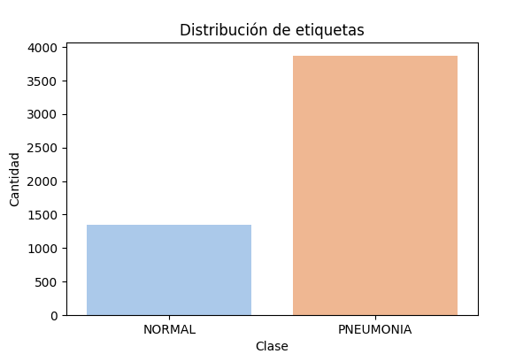
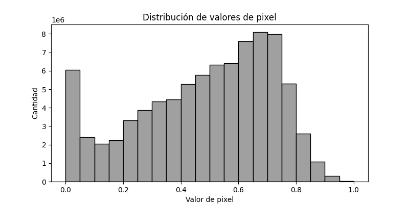
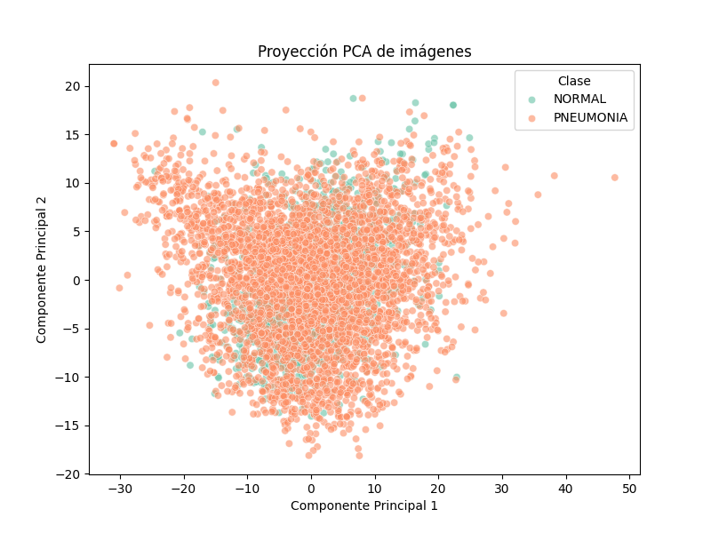

# Reporte de Datos

Este documento contiene los resultados del análisis exploratorio de datos del conjunto Chest X-Ray Images (Pneumonia), implementado como parte del procesamiento basada en Spark y Pandas.

## Resumen general de los datos

El conjunto de datos fue descargado desde [Kaggle - Chest X-Ray Images (Pneumonia)](https://www.kaggle.com/datasets/paultimothymooney/chest-xray-pneumonia) y contiene **5,863 imágenes de rayos X de tórax pediátricos**, en formato JPEG. Las imágenes están organizadas en tres carpetas: `train`, `val` y `test`, con subcarpetas para cada clase (`NORMAL` y `PNEUMONIA`).

Como parte del proceso de preprocesamiento, se diseñó un pipeline ETL que transforma las imágenes en una estructura tabular:

- Las imágenes se codifican en formato binario (`content`) y se almacenan como archivos Parquet (etapa *Silver*).
- Posteriormente, se extraen los pixeles, se convierten a escala de grises, se redimensionan a 128×128 píxeles y se normalizan (etapa *Gold*).
- Cada imagen procesada es representada como un vector de 16,384 valores entre 0 y 1.

Las columnas del conjunto procesado incluyen:

- `imagen_id`, `ruta_origen`, `clase`, `clase_codificada`, `split`
- `pixel_0` hasta `pixel_16383` (valores de los píxeles)

## Resumen de calidad de los datos

Durante el preprocesamiento se realizaron las siguientes verificaciones de calidad:

- Las imágenes ilegibles o con errores de lectura fueron descartadas.
- Se codificaron las etiquetas (`NORMAL`, `PNEUMONIA`) como valores numéricos (`0`, `1`).
- No se detectaron valores nulos ni duplicados tras la carga de los Parquet.
- Todas las imágenes fueron homogeneizadas a una dimensión fija de 128×128.
- Las imágenes se almacenaron separadas por clase y particionadas por split.

Esto permitió asegurar la trazabilidad, limpieza y consistencia de los datos desde su origen hasta su transformación final.
## Variable objetivo

La variable objetivo es **`clase`**, que indica la presencia o no de neumonía. Esta variable toma dos valores:

- `NORMAL`: pacientes sin diagnóstico de neumonía.
- `PNEUMONIA`: pacientes diagnosticados con neumonía.

Se graficó la distribución de clases para el conjunto de entrenamiento, evidenciando un **importante desbalance de clases**, con mayor proporción de imágenes etiquetadas como *PNEUMONIA*.

Este desbalance será relevante en fases posteriores de entrenamiento de modelos supervisados, ya que puede inducir sesgo predictivo si no se compensa adecuadamente.

## Variables individuales

Las variables individuales son los valores de los 16,384 píxeles de cada imagen, reescalados entre 0 y 1.

Se visualizó la distribución global de los valores de píxel en el conjunto de entrenamiento. La mayoría de los valores se concentra en rangos intermedios (0.5 a 0.7), con menor frecuencia de valores extremos cercanos a 0 o 1. Esto es coherente con la estructura típica de una radiografía en escala de grises.

Además se verificó que no existen valores anómalos ni distorsiones por sobreexposición o subexposición, gracias al control de calidad previo.

## Ranking de variables

La proyección de las imágenes en el espacio generado por los dos primeras componentes principales (PCA) muestra que la variabilidad más relevante del conjunto no está alineada directamente con la clasificación entre `NORMAL` y `PNEUMONIA`.

Aunque existe cierta concentración de ejemplos de neumonía en regiones del espacio PCA, no se observa una separación clara entre clases lo que sugiere que la distinción requiere un enfoque más complejo y supervisado.

Este análisis permite concluir que, si bien existen patrones globales en las imágenes, la tarea de clasificación requiere capturar relaciones más profundas entre regiones específicas del contenido visual. PCA, en este caso, aporta una perspectiva muy útil, pero no suficiente para clasificar directamente.

## Relación entre variables explicativas y variable objetivo

En este conjunto de datos, las variables explicativas corresponden a los valores individuales de 16,384 píxeles por imagen. Estas variables, al no tener significado individual (por ejemplo, `pixel_47` o `pixel_1023`), no pueden ser interpretadas de forma directa como en datasets tabulares tradicionales.

Se intentó explorar esta relación a través del análisis de componentes principales (PCA). Pero, la proyección en las primeras dos componentes no mostró una separación clara entre las clases `NORMAL` y `PNEUMONIA`, lo que sugiere que las direcciones de máxima varianza no están alineadas con la variable objetivo.

Tampoco se generó una matriz de correlación completa ni modelos lineales simples, ya que:

- El número de variables es extremadamente alto.
- La relación entre los pixeles y la clase es compleja, probablemente no lineal y dependiente del contexto visual.

Por estas razones, se concluye que la relación entre las variables explicativas y la variable objetivo podrían, tal vez  requierir técnicas supervisadas más avanzadas, como Una red neuronal convolucional (CNN) o modelos basados en árboles de decisión, los cuales podrán capturar patrones espaciales o jerárquicos presentes en las imágenes.

El análisis PCA realizado sigue siendo valioso para comprender la estructura general de los datos y servirá como base para métodos supervisados en etapas posteriores del proyecto.