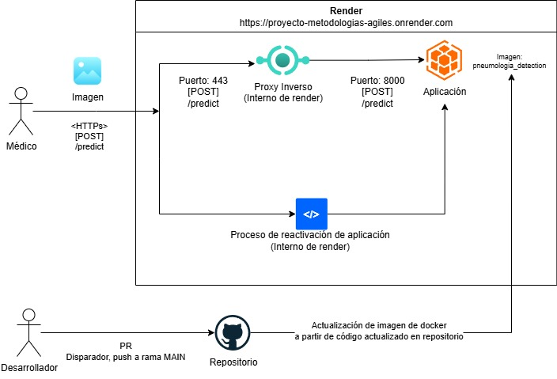

# Despliegue de modelos

## Infraestructura

- **Nombre del modelo:** Pneumonia detection
- **Plataforma de despliegue:** Se desplegó el proyecto en la plataforma Render mediante la definición de una imagen de docker encontrable en la raíz del proyecto con el nombre de archivo **Dockerfile**. En este archivo se expone el puerto correspondiente al servicio desarrollado, siendo este el número de puerto 8000.
  A través de Render, se construya la imagen del proyecto y se ejecuta en una máquina virtual aislada y gestionada por la plataforma de manera gratuita; cabe mencionar que existen ciertas consideraciones menores, como la inactividad del servicio en desuso hasta la recepción de una primera petición en un periodo de tiempo dado.
- **Requisitos técnicos:**
  Como se describe en la definición de imagen de Docker del archivo Dockerfile, se utiliza una versión de python 3.11, en conjunto con las librerías ampliamente descritas en el archivo requirements.txt, pero con las versiones enunciadas a continuación:

  - matplotlib==3.10.3
  - numpy==2.1.3
  - pandas==2.3.0
  - pillow==11.3.0
  - pyarrow==20.0.0
  - scikit-image==0.25.2
  - scikit-learn==1.7.0
  - seaborn==0.13.2
  - tensorflow==2.19.0

  El despliegue realizado funciona sobre una infraestructura relativamente ligera con 256 MB de memoria volátil (RAM) y 0.1 unidades de CPU virtual
  Se recomienda un sistema operativo Linux o Windows compatible con la versión de python: 3.11

- **Requisitos de seguridad:**
  No se tienen políticas estrictas con respecto a seguridad debido a las características públicas y de código abierto del proyecto. No se posee un método de autenticación definido para el llamado al endpoint HTTP expuesto por el servicio. Sin embargo, por defecto la plataforma se encarga de la encriptación de datos a través del protocolo HTTPs estándar, el cual permite la encriptación de información mediante un modelo asimétrico basado en la generación y uso de certificados.
  Se tiene una sección de validación de esquema que permite verificar las características de la imagen enviada a fin de permitir su correcta adaptación a la entrada esperada por el modelo.

- **Diagrama de arquitectura:**
  Se presentan los componentes que hacen parte del diagrama general de la arquitectura definida. Se definen además elementos de despliegue continuo a través de repositorio.
  Se utiliza un proveedor externo de despliegues documentado en: https://github.com/marketplace/actions/deploy-to-render. Así mismo, se crea un API Key para la autenticación de las peticiones realizadas para el re-despliegue del proyecto.

  

## Código de despliegue

- **Archivo principal:** El archivo principal de despliegue se localiza en la ruta **scripts/deploy/deploy.py**. Así mismo, se crea una imagen de docker en la raíz del proyecto con el nombre **Dockerfile**. De manera similar, se crea un nuevo servicio en el archivo definición de **docker-compose.yml** para generar el despliegue del servicio.
- **Rutas de acceso a los archivos:** Los archivos necesarios para el despliegue se encuentran en:
  - ./src: Archivos de código generales para la implementación de todo el esquema del servicio y la estructura de código dada
  - ./artifacts: Archivos de resultados de despliegues, incluyendo modelos guardados, imágenes de resultados y archivos resumen en formato JSON
  - ./scripts: Puntos de entrada a procesos varios, incluyendo visualización, entrenamiento de modelos, entre otros.
- **Variables de entorno:**
  Para el despliegue, se requiere de la ruta de acceso al archivo definición de los pesos el modelo. El identificador de esta variable de entorno es: **MODEL_PATH** (En general, esta ruta debería hacer referencia a un archivo en formato .h5 en la carpeta /artifacts)
  Se requiere además de la definición de la ruta raíz de Python: **PYTHONPATH** (por defecto /app/src)

## Documentación del despliegue

- **Instrucciones de instalación:**

El despliegue se gestiona a través de Docker para garantizar la consistencia y reproducibilidad del entorno. Los pasos para la instalación en un sistema local son los siguientes:

1.  **Prerrequisitos:** Se requiere tener **Git** y **Docker/Docker Compose** instalados en el sistema operativo.
2.  **Clonar el Repositorio:** Toca ejecutar el siguiente comando en una terminal para descargar el código fuente.
    ```bash
    git clone [https://github.com/FallenMap/proyecto_metodologias_agiles.git](https://github.com/FallenMap/proyecto_metodologias_agiles.git)
    cd proyecto_metodologias_agiles
    ```
3.  **Se debe construir la Imagen Docker:** Este comando procesa el `Dockerfile` para construir la imagen, instalando las dependencias de Python y empaquetando la aplicación.
    ```bash
    docker-compose build
    ```
4.  **Ejecutar el Contenedor:** Este comando inicia la aplicación en modo desacoplado (`-d`). El servicio quedará disponible en el puerto 8000 del host.
    ```bash
    docker-compose up -d
    ```
    La plataforma de despliegue en producción (Render) está configurada para el despliegue automático. Cualquier modificación en los archivos de configuración del repositorio podría afectar los despliegues automáticos.

- **Instrucciones de configuración:** La configuración del entorno se gestiona a través de archivos de Docker y no requiere modificaciones para una ejecución estándar.

  - **Ruta del Modelo:** La variable de entorno `MODEL_PATH` especifica la ruta absoluta del modelo de predicción dentro del contenedor. Su valor por defecto es `/app/artifacts/models/CNN/v2.h5` y se define en el `Dockerfile` y `docker-compose.yml`.
  - **Puerto de Red:** La aplicación se ejecuta en el puerto `8000` dentro del contenedor. El archivo `docker-compose.yml` mapea este puerto al `8000` de la máquina anfitriona (`ports: ["8000:8000"]`).
  - **Entorno de Desarrollo:** El `docker-compose.yml` utiliza volúmenes para sincronizar el código local con el contenedor, agilizando el ciclo de desarrollo. Para producción, el `Dockerfile` utiliza la instrucción `COPY` para crear una imagen inmutable, lo cual es una práctica recomendada.

- **Instrucciones de uso:** Una vez desplegado, el modelo es accesible a través de una API REST.

  - **Endpoint:** `/predict`
  - **Método:** `POST`
  - **URL (Producción):** `https://proyecto-metodologias-agiles.onrender.com/predict`
    - **Nota:** Esta URL corresponde a un servicio desplegado en el plan gratuito de Render. El servicio puede entrar en estado de inactividad tras un periodo sin uso. La primera solicitud después de la inactividad puede experimentar una latencia elevada (hasta 40 segundos) mientras el servicio se reactiva.
  - **URL (Local):** `http://localhost:8000/predict`
  - **Cuerpo de la Solicitud:** La solicitud debe ser de tipo `multipart/form-data` y contener un campo `file` con la imagen (`.jpeg` o `.jpg`) a clasificar.
  - **Ejemplo con `curl`:**
    ```bash
    curl -X 'POST' \
      '[https://proyecto-metodologias-agiles.onrender.com/predict](https://proyecto-metodologias-agiles.onrender.com/predict)' \
      -H 'accept: application/json' \
      -H 'Content-Type: multipart/form-data' \
      -F 'file=@/ruta/completa/a/la/imagen.jpg'
    ```
  - **Uso con Postman:**
    1.  Crear una nueva solicitud y seleccionar el método `POST`.
    2.  Ingresar la URL del servicio (local o de producción).
    3.  Navegar a la pestaña **Body** y seleccionar la opción **form-data**.
    4.  En la tabla de `KEY`, ingresar `file`.
    5.  En el extremo derecho de la misma fila, hacer clic en el menú desplegable que por defecto dice "Text" y seleccionar **"File"**.
    6.  Aparecerá un botón **"Select Files"**. Hacer clic para adjuntar la imagen desde el sistema de archivos.
    7.  Enviar la solicitud.
  - **Respuesta Exitosa:** Devuelve un objeto JSON con los resultados de la predicción.
    ```json
    {
      "filename": "imagen.jpg",
      "prediction": "PNEUMONIA",
      "probability": 0.9987
    }
    ```

- **Instrucciones de mantenimiento:** Las tareas de mantenimiento se centran en la monitorización y actualización del servicio.
  - **Monitorización de Logs:** Para revisar los registros de la aplicación en tiempo real, utilice el siguiente comando:
    ```bash
    docker-compose logs -f deploy
    ```
  - **Actualización del Modelo:**
    1.  Reemplazar el archivo del modelo en el directorio local `./artifacts/models/CNN/`.
    2.  Si el nombre del archivo del nuevo modelo es diferente, actualizar la variable `MODEL_PATH` en el `docker-compose.yml`.
    3.  Reconstruir la imagen y reiniciar el servicio:
        ```bash
        docker-compose build && docker-compose up -d
        ```
  - **Actualización de Dependencias:**
    1.  Modificar el archivo `requirements.txt` con las librerías o versiones deseadas.
    2.  Reconstruir la imagen usando la opción `--no-cache` para forzar la reinstalación de las dependencias y reiniciar el servicio.
        ```bash
        docker-compose build --no-cache && docker-compose up -d
        ```
