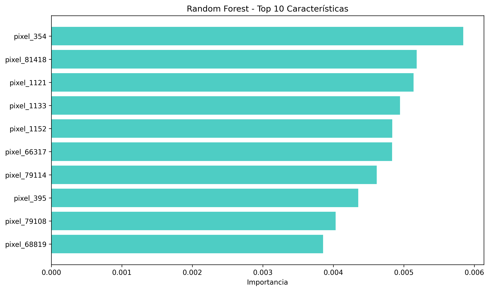

# **Reporte del Modelo Baseline**

Este documento contiene los resultados del modelo baseline.

---

## **Descripción del modelo**

El modelo baseline es un **Random Forest Classifier**, implementado con la librería `scikit-learn` de Python. Este modelo se utiliza para establecer una primera línea de rendimiento medible en el problema de clasificación de neumonía.

Su propósito es doble:

1.  Confirmar que existe una señal predecible en los datos.
2.  Servir como un punto de comparación objetivo para evaluar modelos más complejos, como la Red Neuronal Convolucional (CNN).

El modelo fue entrenado utilizando un proceso de validación cruzada y búsqueda de hiperparámetros (`GridSearchCV`) para encontrar la mejor combinación de parámetros.

---

## **Variables de entrada**

Las variables de entrada para este modelo consisten en un vector de **16,384 características**. Cada una de estas características corresponde al valor normalizado de un píxel de las imágenes de rayos X, las cuales fueron preprocesadas de la siguiente manera:

- Convertidas a escala de grises.
- Redimensionadas a un tamaño estándar de 128x128 píxeles.
- Aplanadas para convertir la matriz de la imagen 2D en un vector 1D.

---

## **Variable objetivo**

La variable objetivo es `clase_codificada`, una variable categórica binaria que representa el diagnóstico de la radiografía:

- **0**: NORMAL (ausencia de neumonía).
- **1**: PNEUMONIA (presencia de neumonía).

---

## **Evaluación del modelo**

### **Métricas de evaluación**

La métrica principal utilizada para evaluar el rendimiento del modelo fue la **Precisión (Accuracy)**. Esta métrica mide el porcentaje de predicciones que el modelo realizó correctamente sobre el conjunto de datos de prueba.

### **Resultados de evaluación**

La tabla muestra el resultado final de la evaluación del modelo baseline.

| Métrica              | Valor  |
| :------------------- | :----- |
| Precisión (Accuracy) | 73.72% |

---

## **Análisis de los resultados**

El modelo baseline alcanzó una precisión del 73.72%, confirmando que los datos de los píxeles contienen información útil para la clasificación.

- **Fortalezas**:
  - **Rapidez y Simplicidad**: El modelo es computacionalmente eficiente y mas rápido de entrenar.
  - **Interpretabilidad Parcial**: Permite caclular la importancia de cada característica (píxel), ofreciendo una idea de qué áreas de la imagen son más influyentes para el modelo. El siguiente gráfico muestra los 10 píxeles que el modelo consideró más importantes para realizar su clasificación.
  - **Robustez**: Los Random Forest son generalmente robustos al sobreajuste en comparación con modelos más complejos, especialmente con datos de alta dimensionalidad.

- **Debilidades**:
  - **Pérdida de Información Espacial**: La debilidad más importante es que, al aplanar la imagen en un vector, el modelo pierde por completo la relación espacial entre los píxeles. No puede aprender patrones, texturas o formas, que son cruciales para el diagnóstico radiológico.

---

## **Conclusiones**

El modelo baseline cumple su propósito al establecer una marca de rendimiento sólida de **73.72%**. Demuestra que es posible predecir la neumonía a partir de los datos de los píxeles.

Sin embargo, su principal limitación es la incapacidad de procesar la estructura 2D de las imágenes. Esta conclusión justifica claramente la necesidad de explorar arquitecturas más avanzadas, como las **Redes Neuronales Convolucionales (CNNs)**, que están específicamente diseñadas para preservar y analizar la información espacial, y que tienen el potencial de superar significativamente este rendimiento base.

---

## **Referencias**

Raschka, S., & Mirjalili, V. (2019). Python machine learning: Machine learning and deep learning with Python, scikit-learn, and TensorFlow 2. Packt publishing ltd.

- Mooney, P. (2018). _Chest X-Ray Images (Pneumonia)_. Kaggle. Recuperado de: [https://www.kaggle.com/datasets/paultimothymooney/chest-xray-pneumonia](https://www.kaggle.com/datasets/paultimothymooney/chest-xray-pneumonia)
