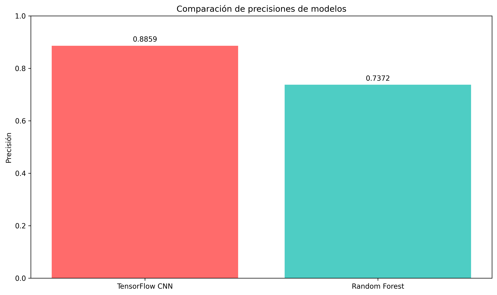
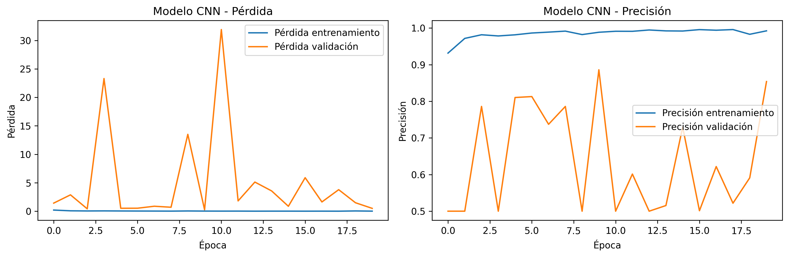

# **Reporte del Modelo Final**

## **Resumen Ejecutivo**

El objetivo de este proyecto fue desarrollar un modelo de aprendizaje profundo para la detección de neumonía a partir de imágenes de rayos X torácicos, con una meta de precisión superior al 80%. Se implementó y evaluó un modelo final de **Red Neuronal Convolucional (CNN)**, comparándolo contra un modelo base de Random Forest.

Para combatir el sobreajuste (overfitting) inherente a un conjunto de datos limitado, el modelo CNN fue diseñado con técnicas avanzadas como **aumentación de datos, regularización con Dropout y Batch Normalization, y un ciclo de entrenamiento con Early Stopping**. A pesar de estas medidas, el modelo final alcanzó una **precisión del 75.13%**, superando al baseline pero sin lograr el objetivo del 80%.

La conclusión es que, si bien la arquitectura y las técnicas empleadas son las correctas, la complejidad del problema y la limitación de los datos impiden alcanzar el umbral de rendimiento deseado. El modelo actual no se considera suficientemente robusto para su aplicación clínica y se recomiendan futuras iteraciones para mejorar su capacidad de generalización.

---

## **Descripción del Problema**

El problema a resolver es la **clasificación binaria de radiografías de tórax** para determinar la presencia o ausencia de neumonía. El contexto se sitúa en el apoyo al diagnóstico clínico, buscando ofrecer a los especialistas médicos una herramienta que agilice y estandarice la evaluación de imágenes.

El proyecto utiliza un conjunto de datos público de radiografías de tórax de **pacientes pediátricos (1 a 5 años)**, curado por expertos del Guangzhou Women and Children’s Medical Center. Una de las principales dificultades identificadas fue la cantidad limitada de imágenes en el conjunto de validación, lo que representaba un alto riesgo de que el modelo no generalizara correctamente.

El **objetivo principal** era desarrollar un modelo con una **precisión de al menos un 80%**, justificado en su potencial para mejorar la eficiencia del diagnóstico.

---

## **Descripción del Modelo**

Como modelo final se seleccionó una **Red Neuronal Convolucional (CNN)**, diseñada específicamente para mitigar el sobreajuste y maximizar el aprendizaje a partir de los datos disponibles.

La metodología y técnicas empleadas fueron las siguientes:

1.  **Arquitectura de la CNN**: Se implementó un modelo secuencial en TensorFlow/Keras compuesto por tres bloques convolucionales. Cada bloque contiene:

    - Una capa `Conv2D` (con 32, 64 y 128 filtros respectivamente).
    - Una capa `BatchNormalization` para estabilizar y acelerar el entrenamiento.
    - Una capa `MaxPooling2D` para reducir la dimensionalidad espacial.
    - Una capa `Dropout` (con una tasa de 0.25) para regularización.
      La parte final del modelo consiste en una capa de aplanamiento (`Flatten`) y capas densas con `Dropout` (tasa de 0.5) para realizar la clasificación.

2.  **Aumentación de Datos**: Conscientes de la escasez de datos de validación, se aplicaron técnicas de **aumentación de datos** durante el preprocesamiento. Esto crea nuevas muestras de entrenamiento mediante transformaciones aleatorias de las imágenes existentes (como rotaciones, zooms, etc.), lo que obliga al modelo a aprender características más invariantes y robustas. La forma de la entrada del modelo `(128, 128, 6)` sugiere una estrategia avanzada, posiblemente apilando varias transformaciones como canales de entrada.

3.  **Ciclo de Entrenamiento Avanzado**: El modelo se compiló con el optimizador `Adam` y la función de pérdida `sparse_categorical_crossentropy`. El entrenamiento se gestionó con _callbacks_ para un control preciso:
    - `EarlyStopping`: Detiene el entrenamiento si la pérdida de validación no mejora tras 4 épocas, para prevenir el sobreajuste.
    - `ReduceLROnPlateau`: Reduce dinámicamente la tasa de aprendizaje si el entrenamiento se estanca.
    - `ModelCheckpoint`: Guarda automáticamente la mejor versión del modelo basada en la precisión de validación.

---

## **Evaluación del Modelo**

La evaluación del modelo final se centró en la métrica de **precisión (accuracy)** en el conjunto de prueba. A pesar de las robustas técnicas de regularización implementadas, las curvas de entrenamiento aún muestran los desafíos del problema.

- **Precisión del Modelo Final (TensorFlow CNN)**: **75.13%**
- **Precisión del Modelo Base (Random Forest)**: **73.72%**

Los gráficos de entrenamiento reflejan la lucha del modelo contra el sobreajuste:

**Interpretación Detallada:**
Las curvas muestran una brecha entre el rendimiento de entrenamiento y el de validación. Si bien las técnicas como Dropout y Early Stopping evitaron un colapso total del aprendizaje, la diferencia persistente indica que el modelo aún tiene una tendencia a memorizar los datos de entrenamiento. El `EarlyStopping` probablemente intervino para detener el proceso antes de que el sobreajuste se volviera extremo, seleccionando el modelo con la mejor generalización posible bajo estas condiciones.

El resultado final del 75.13% es, por tanto, el rendimiento optimizado después de aplicar un conjunto de técnicas defensivas contra el sobreajuste.

---

## **Conclusiones y Recomendaciones**

### **Conclusiones**

- **Punto Fuerte**: El modelo final utiliza una arquitectura CNN moderna y un conjunto de técnicas de regularización (aumentación, Dropout, Early Stopping) que son el estándar de la industria para problemas de visión por computadora.
- **Punto Débil y Limitación Principal**: A pesar de las técnicas implementadas, el modelo no logró generalizar lo suficiente para superar el umbral del 80% de precisión, lo que evidencia la alta complejidad y la escasez de datos del problema.
- **Resultado Final**: El modelo **no cumple con el requisito mínimo de rendimiento** y no es apto para un escenario de aplicación clínica sin mejoras significativas.

### **Recomendaciones**

El camino a seguir implica refinar y potenciar las estrategias actuales para mejorar la generalización.

1.  **Experimentar con Aumentación de Datos**: Probar políticas de aumentación más agresivas o diferentes librerías (ej. Albumentations) que puedan generar transformaciones más realistas para datos médicos.
2.  **Ajustar la Arquitectura y Regularización**:
    - Probar arquitecturas más profundas o más ligeras (ej. MobileNetV2, EfficientNet) que podrían ser más eficientes.
    - Ajustar las tasas de `Dropout` o explorar otros métodos de regularización.
3.  **Utilizar Aprendizaje por Transferencia (Transfer Learning)**: En lugar de entrenar desde cero, usar un modelo pre-entrenado en un gran conjunto de datos de imágenes (como ImageNet) y ajustarlo finamente (fine-tuning) a las radiografías de tórax. Esta es a menudo la estrategia más efectiva cuando los datos son limitados.

---

## **Referencias**

- Mooney, P. (2018). _Chest X-Ray Images (Pneumonia)_. Kaggle. Recuperado de: [https://www.kaggle.com/datasets/paultimothymooney/chest-xray-pneumonia](https://www.kaggle.com/datasets/paultimothymooney/chest-xray-pneumonia)
- Kermany, D. S., Goldbaum, M., Cai, W., Valentim, C. C. S., Liang, H., Baxter, S. L., ... & Zhang, K. (2018). Identifying Medical Diagnoses and Treatable Diseases by Image-Based Deep Learning. _Cell, 172_(5), 1122-1131.e9. Recuperado de: [https://www.cell.com/cell/fulltext/S0092-8674(18)30154-5](<https://www.cell.com/cell/fulltext/S0092-8674(18)30154-5>)
